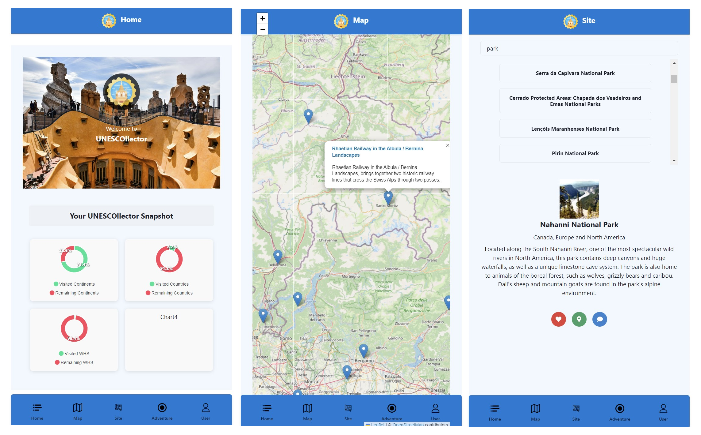
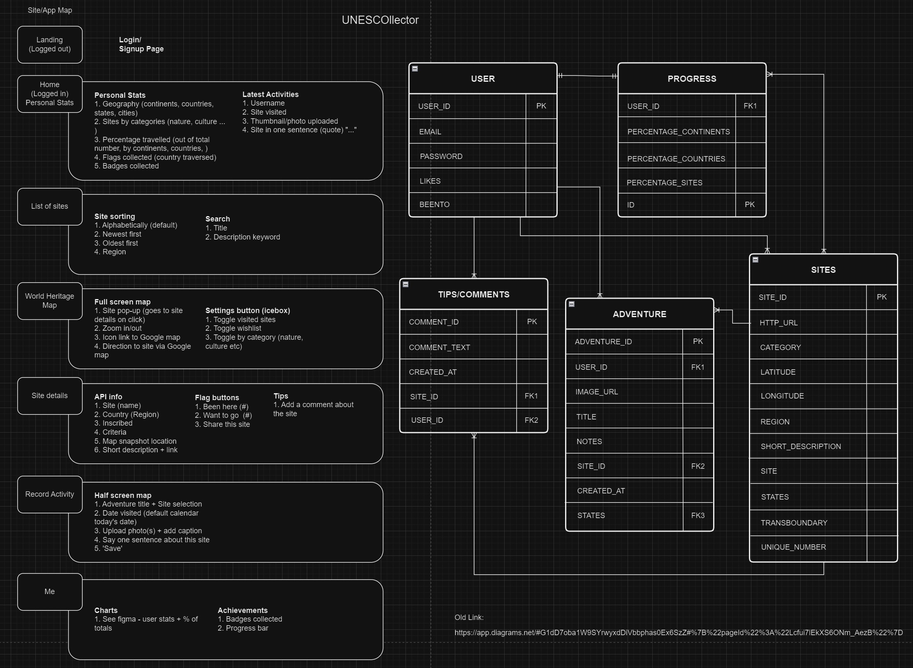
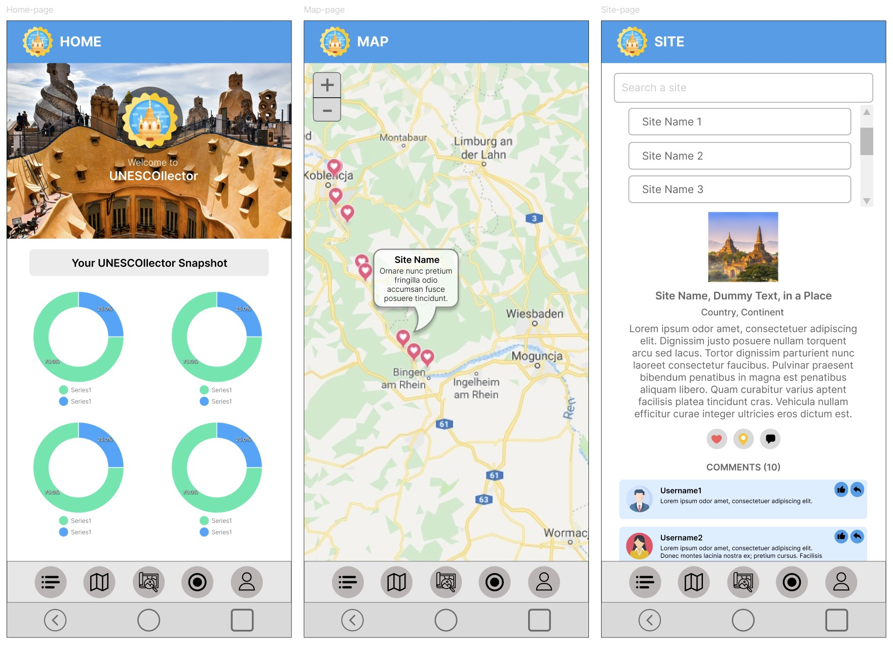

# UNESCOllector

A mini mobile app to access UNESCO World Heritage Sites on the map and to track your site-hopping progress. This is also a good opportunity for the geeks to document their adventures while taking notes on lessons learnt on the go. 

***

## Screenshots
#### Routes


***
## Technologies Used
* Javascript
* React JS 
* MongoDB
* Mongoose
* ChakraUI
* Leaflet Map 
* ApexCharts
* xml2js 

***
## Process
#### Planning & Workflow


#### UI Sketch (Figma)


***
## Favourites

```
Data parsing: Enables the whole project - makes raw data accessible:

const fs = require('fs')
const xml2js = require('xml2js');
const transformData = require('./03_transformData');

const xmlFilePath = './dataParse/whc-en.xml'

const parseXML = async (filePath) => {
    const parser = new xml2js.Parser(); 
    const xmlData = fs.readFileSync(filePath, 'utf8'); 

    try {
        const result = await parser.parseStringPromise(xmlData);
        return result; 
    } catch (error) {
        console.error('Error parsing XML', error)
        throw error; 
    }
}

const transformedData = (data) => {
    const transformedData = {...data, newField: 'example'}
    return transformedData; 
}

const storeLocalJSON = (jsonData, outputFilePath) => {
    fs.writeFileSync(outputFilePath, JSON.stringify(jsonData, null, 2));
    console.log(`JSON data saved to ${outputFilePath}`);
}

const main = async() => {
    try {
        const jsonData = await parseXML(xmlFilePath);
        const transformedData = transformData(jsonData);

        const jsonFilePath = './dataParse/whc-en.json';
        storeLocalJSON(transformedData, jsonFilePath);
    } catch (error) {
        console.error('An error occurred.', error); 
    }
}

main(); 

```

```
Typescript - very specific and sensitive

interface Site {
    id_number: number; 
    image_url: string; 
    site: string; 
    states: string[];
    region: string; 
    short_description: string; 
}

interface SiteRoutedComponent {
    id_number: string; 
}

const SiteRoutedComponent: React.FC = () =>  {
    const { id } = useParams<{ id?: string }>(); 
    const [siteData, setSiteData] = useState<Site | null>(null); 
    const [error, setError] = useState<string | null>(null); 
    const [loading, setLoading] = useState(true) ...

```

***
## Challenges Faced 
* Accessing nested data. Errors are not specific to wrong data structure, leading to speculations as to what went wrong. Trial and error, lots of wasted time. 
* Fetching data from backend to frontend. Error 404 etc. could even be caused by not restarting backend server. 
* Misplanned structures for component reuse. Massive refactoring: 

```
//Refactored this into separate file
    // const onLikedClick = async () => {
    //     try {
    //       // console.log('userId:', userId);
    //       // console.log('siteData:', siteData?.id_number);

    //     if (userId && siteData) {

    //       const fetchUserData = async() => {
    //         try {
    //           const userData = await getUserDetails(userId)
              
    //           // const isLiked = userData.likes.includes(siteData.id_number)
    //           // const isBeenTo = userData.beenTo.includes(siteData.id_number)
    //           console.log('This is userData:', userData)
    //           // console.log('This is user likes:', userLikes)

    //           // setLiked(isLiked);
    //           // setBeenTo(isBeenTo);
    //         } catch (error) {
    //           console.error('Error fetching user data:', error); 
    //         }}
    //         fetchUserData();

    //         if (!liked) {
    //             const updatedLikes = await handleLikes(userId, siteData!.id_number.toString())
    //             setLikedList(updatedLikes);
    //             setLiked(true); 
    //         } else {
    //           const updatedLikes = await handleLikes(userId, siteData!.id_number.toString())
    //           setLikedList(updatedLikes);
    //           setLiked(false); 
    //         }}
    //     } catch(error) {
    //         console.error('Error adding to favourites:', error)
    //     }
    //   } 

```

***
## Things I Learned
* Planning seems to fall short - more detailed plan needed
* Fulfil the requirements first. Don't be too engrossed in the minute details
* Never stop learning and be exposed to new libraries and frameworks

***
## Next Steps
* Too large dataset needs to be in backend for use with other models. E.g. 'Site' ID needs to be the key identifier for e.g. 'comments' model. Right now data exists only on frontend. 
* Improve UI and design

***
## Attributions
* [UNESCO - for making live data available FOC](https://whc.unesco.org/en/syndication)
* [ChakraUI](https://v2.chakra-ui.com/getting-started)
* [LeafletMap](https://leafletjs.com/)
* [Flaticon](https://www.flaticon.com/)
* [ApexCharts](https://apexcharts.com/docs/react-charts/)
* And of course, Waihon and Shao Quan for all the knowledge and advice.  


